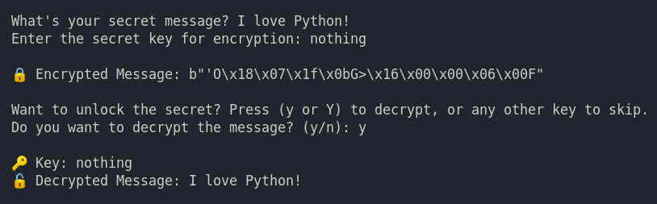
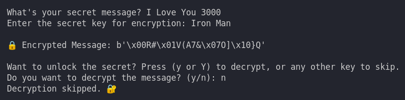
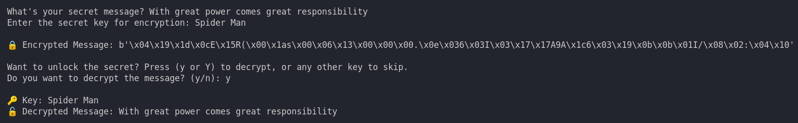

<h1>XOR Cipher Encryption & Decryption</h1>

This repository contains a Python implementation of an XOR cipher for encrypting and decrypting text. The XOR cipher is a simple but effective encryption technique that uses the XOR bitwise operation to transform text.

<h2>Project Overview</h2>
    
This project allows users to encrypt a secret message using a provided key and then decrypt it back to the original message using the same key. The XOR cipher ensures that the encryption and decryption process is straightforward and secure.

<h2>Features</h2>
    <ul>
        <li>Simple and intuitive command-line interface.</li>
        <li>Encrypts and decrypts text using the XOR cipher.</li>
        <li>Ensures the key matches the input text length for effective encryption.</li>
        <li>Interactive prompt for decryption.</li>
    </ul>

<h2>Usage</h2>
    
Clone the repository to your local machine:

    <pre><code>git clone https://github.com/Dark-Programer/secure-xor-encrypt.git</code></pre>
    
Run the Python script:

    <pre><code>python xor_cipher.py</code></pre>
    
Follow the prompts:

    <ul>
        <li>Enter your secret message.</li>
        <li>Enter the key for encryption.</li>
        <li>View the encrypted message.</li>
        <li>Choose to decrypt the message by pressing 'y' or 'Y'.</li>
    </ul>

<h2>Screenshots</h2>
    
Screenshot 1

     
    
Screenshot 2

     
     
Screenshot 3

     

<h2>Author</h2>
    
Arka Chakraborty

<h2>Code Explanation</h2>
    <h3>Python Code</h3>
    
The Python script defines a function <code>xorCipher</code> that performs encryption and decryption using the XOR operation. Here's a brief explanation:

    <ul>
        <li><strong>xorCipher Function:</strong>
            <ul>
                <li>Converts input text and key to bytes if they are strings.</li>
                <li>Ensures the key length matches the input text length by repeating the key if necessary.</li>
                <li>Performs the XOR operation between the input text and the key.</li>
                <li>Returns the result as bytes.</li>
            </ul>
        </li>
        <li><strong>User Input and Interaction:</strong>
            <ul>
                <li>Prompts the user to enter a secret message and a key for encryption.</li>
                <li>Displays the encrypted message.</li>
                <li>Provides an option to decrypt the message using the same key.</li>
            </ul>
        </li>
    </ul>
